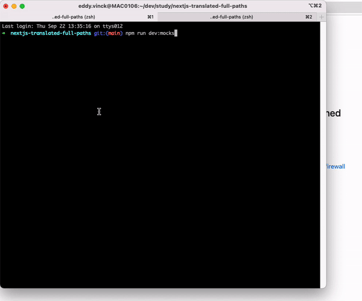

# NextJS Demo with fully translated paths

See the discussion here: https://github.com/vercel/next.js/discussions/18485#discussioncomment-2847338

To start:

```bash
# In one terminal
npm run dev:mocks

# In another terminal
npm run dev
```

And then open http://localhost:3000

Important note: this was not made to be deployed

## Why this demo?

Internationalized routing in NextJS is confusing. This demo serves as an example.

It uses `json-server` as a mock database, and therefore I have written some code to work around it and use it as a "CMS". It's not meant to be pretty, but this results in some code you probably wouldn't need when using a CMS.

This demo is an implementation of the solution suggested here: https://github.com/vercel/next.js/discussions/18485#discussioncomment-2955023

> For people only using an optional catch all route and for dynamic pages in general, this is fairly easy to implement using the default i18n integration.
>
> We use the following approach for an application connected to a headless CMS using said [[...slug]].tsx to handle all pages.
>
> In that case, you'll only have to return your paths providing the correct locale:
>
> ```
> export const getStaticPaths: GetStaticPaths = async ({ locales }) => {
>     if (!locales) {
>         throw new Error("Couldn't find locales.");
>     }
>
>     const pages = await Promise.all(locales.map(getAllPages));
>    const paths = normalizePathParams(pages.flat());
>    const paths = normalizePathParams(pages.flat());
>
>    // [
>    //     { params: { slug: ["about"] }, locale: "en" },
>    //     { params: { slug: ["ueber-uns"] }, locale: "de" },
>    // ]
>
>    return {
>        paths,
>        fallback: "blocking",
>    };
> };
> ```
>
> And within getStaticProps get the correct page data by using the slug and the current locale from the context.

## Relevant NextJS documentation

- [i18n routing](https://nextjs.org/docs/advanced-features/i18n-routing#getting-started)
- [Optional catch all routes](https://nextjs.org/docs/routing/dynamic-routes#optional-catch-all-routes)
- [Middleware](https://nextjs.org/docs/advanced-features/middleware)
- [SEO: You need to add `hreflang` yourself](https://nextjs.org/docs/advanced-features/i18n-routing#search-engine-optimization)

## Caveats

Had to remove index.tsx

```bash
Error: You cannot define a route with the same specificity as a optional catch-all route ("/" and "/[[...slug]]").
    at UrlNode._smoosh (nextjs-translated-full-paths/node_modules/next/dist/shared/lib/router/utils/sorted-routes.js:36:23)
    at UrlNode.smoosh (nextjs-translated-full-paths/node_modules/next/dist/shared/lib/router/utils/sorted-routes.js:11:21)
    at Object.getSortedRoutes (nextjs-translated-full-paths/node_modules/next/dist/shared/lib/router/utils/sorted-routes.js:161:17)
    at Watchpack.<anonymous> (nextjs-translated-full-paths/node_modules/next/dist/server/dev/next-dev-server.js:422:55)
```

[You unfortunately cannot pass additional data from `getStaticPaths` to `getStaticProps`](https://github.com/vercel/next.js/discussions/11272). There is [a workaround using a file sytem cache](https://github.com/vercel/next.js/discussions/11272#discussioncomment-2257876), but it seems far from ideal.
